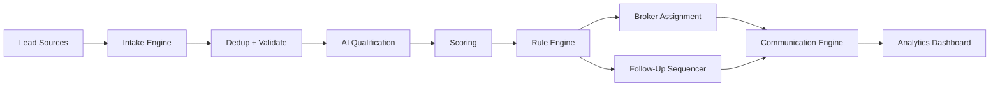

# DealFlow AI Architecture

## System Overview

DealFlow AI uses a layered architecture:

- Presentation Layer: Next.js 15 App Router (marketing + dashboard + BFF routes)
- Application Layer: Express controllers/services
- Data Layer: Prisma with MongoDB
- Async Layer: BullMQ workers with Redis
- Integration Layer: WhatsApp, Meta, Google, Twilio, OpenAI, SendGrid

## High-Level Flow

## Backend MVC Mapping

- Models: Prisma schema + model stubs
- Views: response formatter modules
- Controllers: route handlers per domain
- Services: business logic modules

## Security Model

- Helmet headers
- CORS restricted to frontend origin
- Auth and general rate limits
- JWT access and refresh tokens
- RBAC middleware
- Request validation middleware
- Audit logging for write operations
- AES encryption helper for sensitive fields

## Real-Time Events

Socket namespaces/rooms:

- `org:{organizationId}`
- `user:{userId}`

Events:

- `lead:new`
- `lead:assigned`
- `lead:updated`
- `agent:activity`
- `kpi:update`

## Queue Topology

- `leadProcessing`
- `followUp`
- `communication`
- `reactivation`
- `scoring`
- `voiceCall`
- `reporting`

Each queue uses retries and exponential backoff.

## Deployment

- Frontend app process (port 3000)
- Backend API process (port 5000)
- Redis process for queues
- MongoDB Atlas cluster via `MONGODB_URI`
